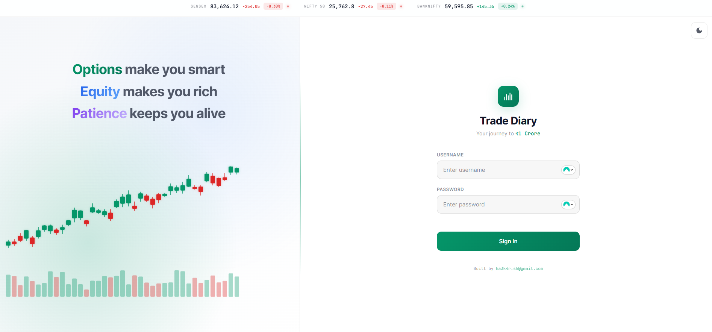
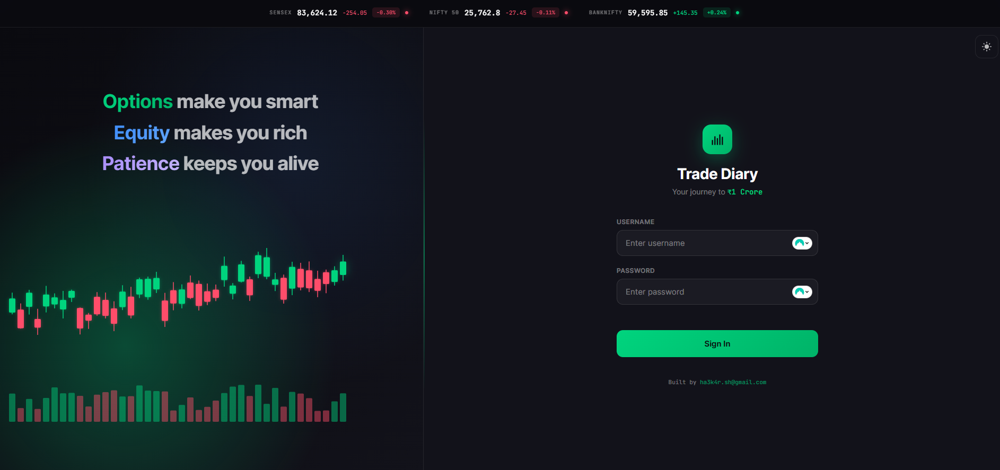

# Trade Diary - Personal Trading Journal

A Python-based personal trading journal with username/password authentication and Google Authenticator MFA.

## Application Screenshot




## Features

- **Authentication**: Username/password with TOTP MFA (Google Authenticator)
- **Trade Management**: Log trades with averaging, track targets (3%/5%/10%/20%), learnings
- **Plan Alignment**: Track progress against 200-trade compound growth plan (40K → 1Cr)
- **Investment Tracking**: Capital deposits, reserve fund, withdrawals
- **Expense Management**: Track recurring expenses (TradingView, AI tools, brokerage)
- **Holiday Calendar**: NSE holiday tracking with alerts

## Tech Stack

- **Backend**: FastAPI (Python)
- **Database**: SQLite with SQLAlchemy
- **Auth**: JWT + TOTP (pyotp)
- **Frontend**: Vanilla JS + Tailwind CSS

## Setup

### 1. Install Dependencies

```bash
cd trade-diary
pip install -r requirements.txt
```

### 2. Run the Server

```bash
python app.py
```

### 3. Access the App

Open http://localhost:8000

**Default Credentials:**

- Username: `admin `
- Password: `admin`

⚠️ **Change the password immediately after first login!**

## Setup MFA

1. Login with default credentials
2. Go to Settings
3. Click "Setup MFA"
4. Scan QR code with Google Authenticator
5. Enter the 6-digit code to verify

## Configuration

Create a `.env` file to customize:

```env
DATABASE_URL=sqlite:///./trade_diary.db
SECRET_KEY=your-secret-key-here
DEFAULT_USERNAME=ha3k4r
DEFAULT_PASSWORD=YourSecurePassword
```

Generate a secure secret key:

```bash
python -c "import secrets; print(secrets.token_hex(32))"
```

## Project Structure

```
trade-diary/
├── app/
│   ├── main.py           # FastAPI app
│   ├── config.py         # Configuration
│   ├── database.py       # Database connection
│   ├── auth.py           # Authentication logic
│   ├── models/
│   │   └── models.py     # SQLAlchemy models
│   └── routers/
│       ├── auth.py       # Auth endpoints
│       ├── trades.py     # Trade endpoints
│       ├── expenses.py   # Expense endpoints
│       ├── investments.py# Investment endpoints
│       ├── holidays.py   # Holiday endpoints
│       ├── settings.py   # Settings endpoints
│       ├── dashboard.py  # Dashboard endpoints
│       └── plan.py       # Plan endpoints
├── templates/
│   ├── login.html        # Login page
│   └── app.html          # Main SPA
├── static/               # Static files
├── requirements.txt
└── README.md
```

## API Endpoints

### Auth

- `POST /api/auth/login` - Login
- `POST /api/auth/logout` - Logout
- `GET /api/auth/me` - Get current user
- `POST /api/auth/change-password` - Change password
- `POST /api/auth/setup-mfa` - Setup MFA (returns QR code)
- `POST /api/auth/verify-mfa` - Verify and enable MFA
- `POST /api/auth/disable-mfa` - Disable MFA

### Trades

- `GET /api/trades` - List all trades
- `POST /api/trades` - Create trade
- `GET /api/trades/{id}` - Get trade
- `POST /api/trades/{id}/entries` - Add entry (averaging)
- `POST /api/trades/{id}/close` - Close trade

### Dashboard

- `GET /api/dashboard` - Get dashboard data
- `GET /api/dashboard/weekly-chart` - Get weekly chart data

## Instrument Presets

| Instrument        | Lot Size |
| ----------------- | -------- |
| Nifty Option      | 75       |
| Bank Nifty Option | 15       |
| Fin Nifty Option  | 25       |
| Stock Swing       | 1        |

## The Plan

- Start: ₹40,000
- Target: ₹1,00,00,000 (1 Crore)
- Strategy: 4% return per trade × 200 trades

### Milestones

| Trade | Capital |
| ----- | ------- |
| 50    | ₹2.73L  |
| 100   | ₹19.42L |
| 150   | ₹1.38Cr |
| 200   | ₹9.81Cr |

## License

Private - Personal Use Only

By ha3k4r.sh@gmail.com - Aadham
